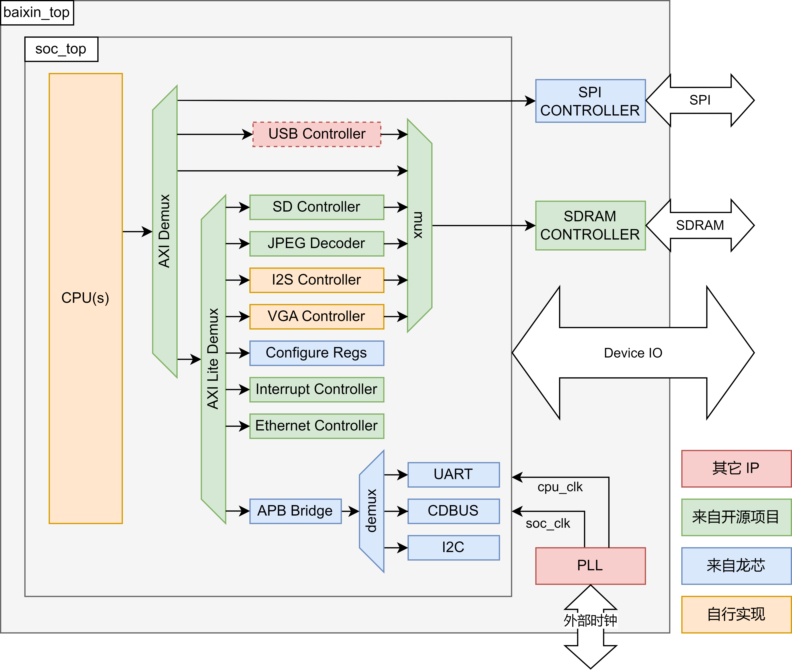

# OpenMegaSoC

## 1 关于

MegaSoC 是由北航百芯计划团队开发的一款 SoC 框架，支持使用 AXI 总线的 LoongArch 指令集处理器的正常工作。

MegaSoC 由北航计算机学院本科生田韵豪 @t123yh 完成面向 MIPS 的[初代版本](https://github.com/orgs/MegaSoC)，并由后续北航百芯计划团队迭代完善。

MegaSoC 初代版本及所支持的MIPS芯片流片工作可参阅：[2022年田韵豪本科毕设论文](./18373444-田韵豪-MIPS处理器设计与操作系统移植.pdf) 

OpenMegaSoC 是 MegaSoC 的开源版本。

## 2 支持外设

OpenMegaSoC 提供了 SPI、SDIO、I2S、VGA、Ethernet、UART、CDBUS、I2C 等硬件外设支持。

### 2.1 AXI4 Peripheral Address Mapping

| Address Range                                            | Device                    | Select Value |
| -------------------------------------------------------- | ------------------------- | ------------ |
| `0x00000000 - 0x0FFFFFFF`                                | Memory Controller         | 0            |
| `0x1C000000 - 0x1C0FFFFF` `0x1D000000 - 0x1D00FFFF` | SPI Device                | 1            |
| `0x1D000000 - 0x1D0FFFFF`                                | AXI-Lite Device           | 2            |
| `0x1D100000 - 0x1D1FFFFF`                                | USB Controller            | 3            |
| Other Addresses                                          | AXI-Lite Device (Default) | 2            |

### 2.2 AXI4-Lite Peripheral Address Mapping

| Address Range             | Device                         | Select Value |
| ------------------------- | ------------------------------ | ------------ |
| `0x1D100000 - 0x1D3FFFFF` | APB Devices (UART, I2C, CDBUS) | 1            |
| `0x1D400000 - 0x1D4FFFFF` | Configuration Registers        | 2            |
| `0x1D500000 - 0x1D5FFFFF` | Ethernet Controller            | 3            |
| `0x1D600000 - 0x1D6FFFFF` | Interrupt Controller           | 4            |
| `0x1D700000 - 0x1D7FFFFF` | SD Controller                  | 5            |
| `0x1DA00000 - 0x1DAFFFFF` | JPEG Controller                | 6            |
| `0x1DB00000 - 0x1DBFFFFF` | I2S Controller-0（DMA）        | 7            |
| `0x1DC00000 - 0x1DCFFFFF` | I2S Controller-1（GEN）        | 8            |
| `0x1DD00000 - 0x1DDFFFFF` | VGA Controller                 | 9            |
| Other Addresses           | SRAM Controller (Default)      | 0            |

### 2.3 IP来源

| 名称                       | 来源                                                         | 作用                                        |
| :------------------------- | ------------------------------------------------------------ | ------------------------------------------- |
| loongson-blocks            | https://gitee.com/loongson-edu/chiplab/tree/chiplab_diff/IP  | 提供UART、CONFREG、SPI控制器                |
| pulp-axi                   | https://github.com/pulp-platform/axi                         | 用于高性能片上通信的 AXI SystemVerilog 模块 |
| pulp-common_cells          | https://github.com/pulp-platform/common_cells                | 常用模块、头文件                            |
| register_interface         | https://github.com/pulp-platform/register_interface          | 通用寄存器接口                              |
| ultraembedded-jpeg_decoder | https://github.com/ultraembedded/core_jpeg_decoder           | JPEG解码器                                  |
| Xilinx-AXI-Intc            | Xilinx开源IP                                                 | 中断控制器                                  |
| Xilinx-emaclite            | Xilinx开源IP                                                 | 以太网控制器                                |
| Xilinx-primitive           | Xilinx开源IP                                                 | cdc、fifo                                   |
| Xilinx-AXIAHB              | Xilinx开源IP                                                 | AXI-AHB总线桥                               |
| ZipCPU-wb2axip             | https://github.com/ZipCPU/wb2axip                            | 总线互连、桥接器和其他组件                  |
| i2c-slave                  | https://github.com/freecores/i2cslave                        | I2C从设备                                   |
| opencores-i2c              | https://github.com/fabriziotappero/ip-cores/tree/communication_controller_i2c_controller_core#vhdlverilog-ip-cores-repository | I2C主设备                                   |
| axi_to_i2s                 | 自主设计                                                     | AXI控制的I2S输出模块                        |
| axi-hdmi                   | 自主设计                                                     | SII-146芯片控制器                           |
| dukelec-cdbus_ip           | https://github.com/dukelec/cdbus                             | CDBUS控制器                                 |
| axi-sdc                    | https://github.com/mczerski/SD-card-controller               | SD卡控制器                                  |

## 3 支持平台

OpenMegaSoC 尽可能以 RTL 形式提供使用到的所有模块，因此对硬件开发平台有最小化的要求。

目前本项目提供面向龙芯百芯计划开发板（7A200T）、北航百芯计划开发板（7K325T）、ZU15MINI开发板（XCZU15EG）三款 FPGA 开发板的支持。

本项目最小化了对厂商相关的 Primitive 使用。对于不同的开发平台，只需要准备 SRAM 、PLL 这两类模块既可。

你可以很轻松的将本项目 SoC 部署到其它平台。具体可参考 Menufacturer/Xilinx 目录下的实现，完成约束和 SRAM 模块的替换即可。

## 4 视频接口说明

OpenMegaSoC 对外输出 RGB888 全彩视频，但需要借助 SII-164 芯片辅助。具体输出格式，请参考 SII-164 芯片数据手册。

视频中的 24位色彩信号采用双边沿时钟采样格式并行传输。SoC 内部按照 VGA 时序生成视频信号，并对 RGB 数据信号做双边沿采样操作。

也可以修改 SoC 中的相关数据通路，改为直接输出单边沿采样的 VGA 信号。
