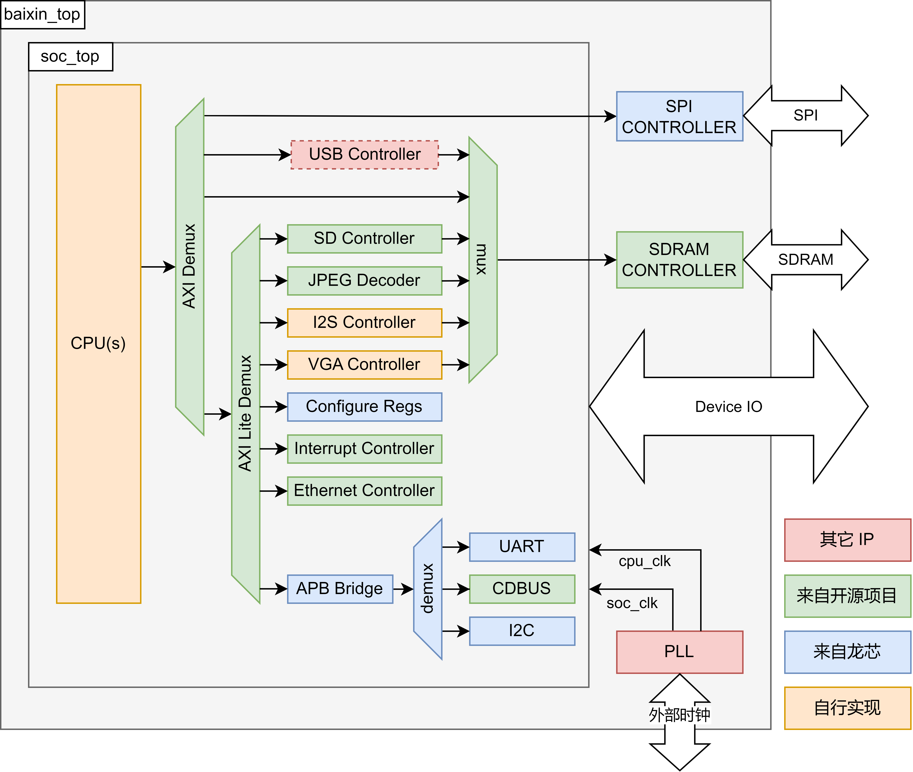

# OpenMegaSoC

## 关于

MegaSoC 是由北航百芯计划团队开发的一款 SoC 框架，支持使用 AXI 总线的 LoongArch 指令集处理器的正常工作。

MegaSoC 由北航计算机学院本科生田韵豪 @t123yh 完成面向 MIPS 的[初代版本](https://github.com/orgs/MegaSoC)，并由后续北航百芯计划团队迭代完善。

MegaSoC 初代版本及所支持的MIPS芯片流片工作可参阅： 

OpenMegaSoC 是 MegaSoC 的开源版本。

## 支持外设

OpenMegaSoC 提供了 SPI、SDIO、I2S、VGA、Ethernet、UART、CDBUS、I2C 等硬件外设支持。

## 支持平台

OpenMegaSoC 尽可能以 RTL 形式提供使用到的所有模块，因此对硬件开发平台有最小化的要求。

目前本项目提供面向龙芯百芯计划开发板（7A200T）、北航百芯计划开发板（7K325T）、ZU15MINI开发板（XCZU15EG）三款 FPGA 开发板的支持。

本项目最小化了对厂商相关的 Primitive 使用。对于不同的开发平台，只需要准备 SRAM 、PLL 这两类模块既可。

你可以很轻松的将本项目 SoC 部署到其它平台。具体可参考 Menufacturer/Xilinx 目录下的实现，完成约束和 SRAM 模块的替换即可。

## 视频接口说明

OpenMegaSoC 对外输出 RGB888 全彩视频，但需要借助 SII-164 芯片辅助。具体输出格式，请参考 SII-164 芯片数据手册。

视频中的 24位色彩信号采用双边沿时钟采样格式并行传输。SoC 内部按照 VGA 时序生成视频信号，并对 RGB 数据信号做双边沿采样操作。

也可以修改 SoC 中的相关数据通路，改为直接输出单边沿采样的 VGA 信号。
